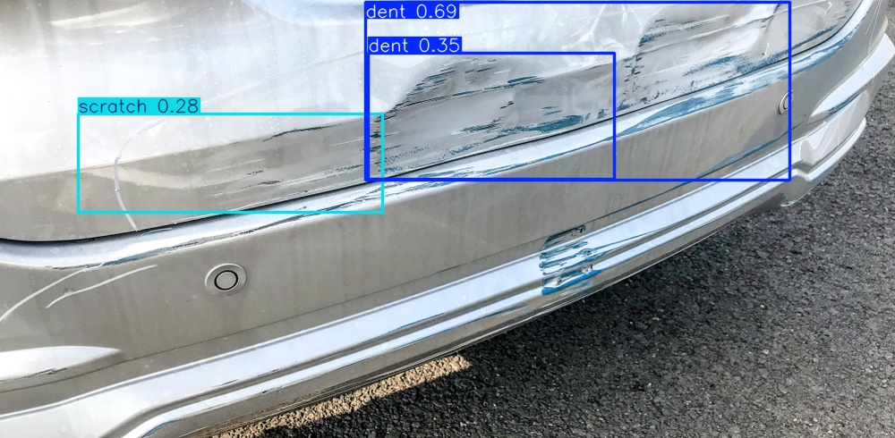
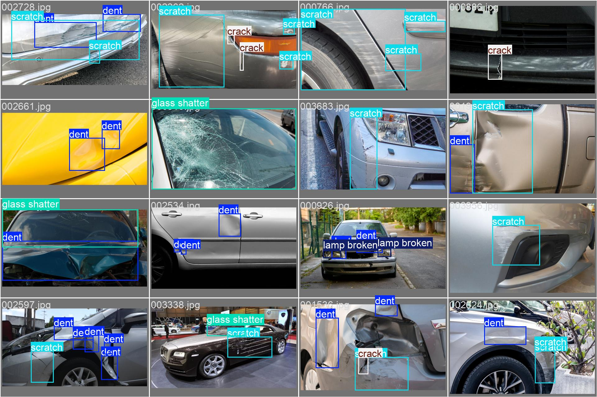
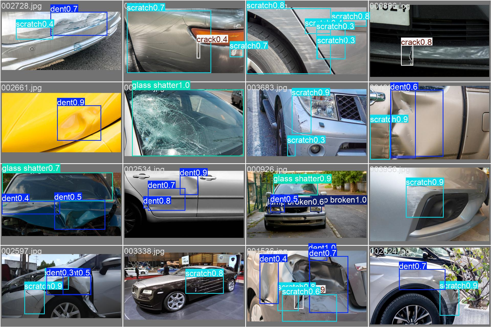

# Vehicle Damage Detection — CarDD

[](https://github.com/JShi12/vehicleDD/actions/workflows/ci.yml)

**🔗 Live demo: [cardd-149g.onrender.com/docs](https://cardd-149g.onrender.com/docs)** - try
`/predict` with your own image. The demo runs on Render's free tier, so allow ~1 min for cold start if it's been idle, and see [Known limitations](#known-limitations) before judging response time.

A **production-style computer-vision component** for the visual-damage stage of a vehicle reconditioning assessment system. The project trains a YOLO11 detector on the public [CarDD](https://cardd-ustc.github.io/) dataset and takes the model from **dataset conversion and reproducible experiments through held-out evaluation, model promotion, containerised inference, CI, and live deployment**. 

**Project snapshot:**

| Area | Implementation |
|---|---|
| Model | YOLO11n |
| Dataset | [CarDD](#dataset) — 4,000 images, 6 damage classes |
| Champion test recall | <!-- promote:snapshot-recall:start -->**0.705**<!-- promote:snapshot-recall:end --> ([current results](#current-champion)) |
| Champion test mAP50 | <!-- promote:snapshot-map50:start -->**0.743**<!-- promote:snapshot-map50:end --> |
| Champion test mAP50-95 | <!-- promote:snapshot-map50-95:start -->**0.560**<!-- promote:snapshot-map50-95:end --> |
| Experiment tracking | [MLflow](#training-pipeline) |
| Serving | [Dockerized FastAPI, live](#inference-service) |
| Testing / CI | [pytest + Ruff + GitHub Actions](#continuous-integration) |
| Model lifecycle | [Versioned releases, PR-gated promotion](#continuous-integration) — not just a training script |
| Model card | [intended use, data, and risks, not just accuracy numbers](MODEL_CARD.md) |

The three champion metrics above are spliced in by the same `cardd-promote` automation that
updates [Current champion](#current-champion) below - one promotion, one source of truth, no
hand-updated number to forget.



## Scope

This repository implements only the damage detection component of a larger end-to-end vehicle condition assessment pipeline. It was built with Claude Code as a development accelerator.

The implemented component detects visible vehicle damage (e.g. dents, scratches, cracks and broken glass) from individual images using an object detection model. The detector is intended to provide the visual evidence for subsequent stages of the system.

Beyond training and evaluation (producing a trained model artifact and its measured performance),
this repo also includes an inference service (FastAPI + Docker, see
[Inference service](#inference-service) below), experiment tracking (MLflow), and an automated,
PR-gated promotion pipeline (see [Continuous integration](#continuous-integration)) - training
itself, however, stays manual on Kaggle. It does **not** include the effort/grade prediction or
recon/auction/write-off decision logic those detections would feed into (see
[Known limitations](#known-limitations)).

For the model itself - intended use, training/eval data, and risks, not just its accuracy numbers
- see [MODEL_CARD.md](MODEL_CARD.md).

## Dataset

[CarDD](https://cardd-ustc.github.io/) (Wang, Li & Wu, 2023) — 4,000 images, 6 damage classes
(dent, scratch, crack, glass shatter, lamp broken, tire flat), official COCO-format train/val/test
split (2,816 / 810 / 374 images).

**The dataset is not included in this repo.** It's licensed by the PIC Lab (Chinese Academy of
Sciences) for research use, requires a signed license request to obtain (see the project page),
and its terms prohibit redistribution ("the user shall not... distribute or broadcast all or
part of the dataset to third parties without prior authorization"). Anyone reproducing this needs
to request their own copy and place it at `data/CarDD_release/CarDD_COCO/`, matching the official
release layout.

**Citation** (required by the license for any publication/report using this data):
```bibtex
@ARTICLE{CarDD,
  author={Wang, Xinkuang and Li, Wenjing and Wu, Zhongcheng},
  journal={IEEE Transactions on Intelligent Transportation Systems},
  title={CarDD: A New Dataset for Vision-Based Car Damage Detection},
  year={2023}, volume={24}, number={7}, pages={7202-7214},
  doi={10.1109/TITS.2023.3258480}}
```

## Repo structure

```
src/cardd/                        installable package - the one canonical implementation
  data/                            coco.py, convert.py, yolo_format.py - COCO -> YOLO conversion
  eda.py                           class counts, image-size distribution, sample grid w/ GT boxes
  config.py                        experiment config schema (YAML -> ExperimentConfig)
  train.py, evaluate.py            training entrypoint + standalone eval, metrics_schema.py/tracking.py
  report.py                        metrics.json -> markdown table (README-table regen helper)
  serving/                         FastAPI inference service (app.py, schemas.py, weights.py)
  cli/                             console-script entrypoints: cardd-eda/convert/verify/train/evaluate
configs/
  cardd_yolo.yaml                  generated by `cardd-convert`
  experiments/                     one YAML per experiment - see Training pipeline below
notebooks/
  01_cardd_yolo11n.ipynb           executed snapshot - run 1 (defaults, imgsz=640)
  02_kaggle-yolo11-cardd-imgsz.ipynb  executed snapshot - run 2 (imgsz=1024, otherwise identical to run 1)
  kaggle_run_template.ipynb        generic template: pick a config, run top to bottom
outputs/
  eda/, sanity/                    local EDA + conversion sanity-check outputs
  kaggle_run/01_baseline/          downloaded weights, metrics, plots - run 1 (imgsz=640)
  kaggle_run/02_imgsz1024/         downloaded weights, metrics, plots - run 2 (imgsz=1024)
models/
  champion.json                    pointer: which run is champion, where its release assets live
  champion_metrics.json            the champion's metrics.json - source of truth for its numbers
tests/                             pytest suite - synthetic-data fixtures only (see CI below)
Dockerfile                         inference service container image
MODEL_CARD.md                      model details/intended use/risks - not just numbers (see README's
                                    Current champion section)
```

## Setup

```bash
python3 -m venv .venv && source .venv/bin/activate
pip install -e ".[train,dev]"
cardd-eda                         # -> outputs/eda/
cardd-convert                     # -> data/cardd_yolo/, configs/cardd_yolo.yaml
cardd-verify                      # -> outputs/sanity/
```

Actual training happened on Kaggle (free T4 GPU) rather than locally. `notebooks/01_cardd_yolo11n.ipynb`
and `notebooks/02_kaggle-yolo11-cardd-imgsz.ipynb` are each the source of truth for their own run
(see their respective `## Results —` sections below) - both re-run the same COCO→YOLO conversion
used locally against the raw dataset, not a pre-converted copy, and both predate the `cardd`
package refactor, inlining that conversion logic directly rather than importing it - kept as-is
since they're the executed evidentiary record. Neither notebook is "the champion," though: which
run is currently promoted is tracked separately, in `models/champion.json` (see
[Current champion](#current-champion) below) - that pointer can move to a different run entirely
after a future promotion, independent of either notebook. New runs use `kaggle_run_template.ipynb`,
which calls the installed package instead of inlining the conversion logic.

## Training pipeline

Every experiment is a YAML file under `configs/experiments/` consumed by one canonical code path
(`cardd.train.run_training`), rather than a bespoke notebook per experiment:

| config | description |
|---|---|
| `01_baseline.yaml` | Ultralytics defaults, YOLO11n, imgsz=640 - the reported run below |
| `02_imgsz1024.yaml` | identical to 01 except imgsz=1024 |
| `03_tuned.yaml` | personalized augmentation + hyperparameter tuning (staged, not yet run - see below) |
| `04_albumentations.yaml` | 03 plus JPEG-compression/motion-blur/brightness augmentation (staged, not yet run) |

```bash
cardd-train --config configs/experiments/01_baseline.yaml
cardd-train --config configs/experiments/03_tuned.yaml --set train.epochs=50  # ad hoc override
```

This trains, runs the held-out test evaluation, writes `metrics.json` (aggregate + per-class
precision/recall/F1/AP50/AP50-95 for both the val and test splits), and logs params/metrics/artifacts
to a local [MLflow](https://mlflow.org/) tracking store (`mlruns/`, gitignored -
`mlflow ui --backend-store-uri mlruns` to browse runs). `cardd-evaluate --weights <path> --split test`
runs a standalone evaluation against an existing checkpoint without retraining -
`src/cardd/report.py` then renders any `metrics.json` into the same markdown table format used below.

## Inference service

A FastAPI service (`src/cardd/serving/`) wraps a trained checkpoint for real-time inference:

- `GET /health` — model-load status, which checkpoint is loaded, and a link back to this repo's
  source (`ultralytics` is AGPL-3.0-licensed; since this is a public network-accessible use of it,
  surfacing the source here keeps AGPL's network-use clause trivially satisfied).
- `POST /predict` — multipart image upload (`conf`/`iou` as optional query params) → JSON
  detections (class, confidence, bounding box), image dimensions, and inference time.

```bash
docker build -t cardd-service .
docker run -p 8000:8000 -e CARDD_MODEL_SOURCE=random-init cardd-service   # smoke test, no real weights
docker run -p 8000:8000 -e CHAMPION_WEIGHTS_URL=<url to a best.pt> cardd-service  # real inference
curl -X POST localhost:8000/predict -F "file=@path/to/image.jpg"
```

With no `CHAMPION_WEIGHTS_URL` set, the service falls back to a GitHub Release asset (see the
Dockerfile). **Public deployment is a manual, one-time step, not automated by CI**: build the image,
push a trained `best.pt` as a GitHub Release asset, and point a host at this repo's `Dockerfile`.

**Live demo**: [cardd-149g.onrender.com/docs](https://cardd-149g.onrender.com/docs) (also linked
at the top of this README) - Render.com free tier, so see the CPU caveat below before judging
response time; allow ~1 min for cold start if the service has spun down after 15 min idle.

Verified locally (Docker via `colima`, not just the equivalent local process) and against the live
deployment: the image builds, boots, and correctly detects damage on real CarDD test images using
the actual trained checkpoint (locally: `tire flat`, confidence 0.68; on Render: `scratch`,
confidence 0.70). `python:3.11-slim` is missing the X11/GL shared libraries `opencv-python` needs
at import time (pulled in transitively through `ultralytics`) - the Dockerfile installs them via
`apt-get` (`libgl1`, `libxcb1`, etc.); without that fix the container fails at startup with
`ImportError: libxcb.so.1: cannot open shared object file`.

## Current champion

Auto-generated by `cardd-promote` whenever a challenger is promoted (see
[Continuous integration](#continuous-integration) below) - do not edit the block below by hand,
it will be overwritten on the next promotion. `models/champion.json` records which run this is and
where its release assets live; `models/champion_metrics.json` is the exact source this table is
rendered from. For the model's intended use, data, and risks (not just its numbers), see
[MODEL_CARD.md](MODEL_CARD.md) - note that file is currently updated by hand, so check it against
`models/champion_metrics.json` if they might have drifted apart.

<!-- promote:champion-results:start -->
## Results — `cardd_yolo11n_imgsz1024`

Config: `configs/experiments/02_imgsz1024.yaml`  
Train time: 2.197 hours  

| split | images | instances | precision | recall | mAP50 | mAP50-95 |
|---|---|---|---|---|---|---|
| val | 810 | 1744 | 0.736 | 0.728 | 0.731 | 0.557 |
| **test** | 374 | 785 | 0.747 | 0.705 | 0.743 | 0.560 |

**Per-class (test set):**

| class | precision | recall | F1 | AP50 | AP50-95 |
|---|---|---|---|---|---|
| dent | 0.628 | 0.606 | 0.617 | 0.613 | 0.341 |
| scratch | 0.607 | 0.579 | 0.593 | 0.567 | 0.297 |
| crack | 0.531 | 0.486 | 0.507 | 0.491 | 0.267 |
| glass shatter | 0.921 | 0.958 | 0.939 | 0.980 | 0.858 |
| lamp broken | 0.900 | 0.782 | 0.837 | 0.895 | 0.728 |
| tire flat | 0.897 | 0.821 | 0.858 | 0.914 | 0.867 |
<!-- promote:champion-results:end -->

**Qualitative check - ground truth vs. predictions**, 16 real held-out test images (not
cherry-picked - the first batch Ultralytics happened to visualize), generated automatically during
the champion's own `.val()` run:

*Ground truth:*


*Model predictions on the same 16 images:*


Unlike the table above, this comparison is **not** auto-regenerated by `cardd-promote` - a future
promotion doesn't produce this specific image pair as part of `metrics.json`, only as a manual
download from the Kaggle run's own qualitative-prediction step. Treat it as illustrative of the
run described above, not guaranteed to match `models/champion_metrics.json` after a later promotion.

## Continuous integration

`.github/workflows/ci.yml` runs on every push/PR: lint (`ruff`), the full `pytest` suite, and a
Docker build-and-boot smoke test. CI never touches real CarDD data or a real trained weight -
CarDD's license forbids redistributing the dataset (including into a CI cache), so `tests/`
procedurally generates a tiny synthetic COCO-format dataset instead (`tests/fixtures/synthetic_dataset.py`)
and trains a random-init model on it for one epoch, purely to prove the pipeline's plumbing is
correct end-to-end. It says nothing about detection accuracy - that's what the Results section
below, run against the real dataset on Kaggle, is for.

**Promotion** is deliberately split across a review gate, in two workflows, so nothing production
reads from changes before a human approves it:

1. **`.github/workflows/promote.yml`** (manually triggered): given a Kaggle-trained challenger's
   Release (tag containing its `best.pt` + `metrics.json`), compares its held-out test recall
   against the current champion (`models/champion_metrics.json`) - this project's own stated
   priority is recall over aggregate mAP, since a missed detection is worse than a false positive
   for the reconditioning-assessment use case this feeds into (see Results Analysis below). If the
   challenger doesn't regress on recall, it publishes a **permanent, versioned** release (safe -
   nothing reads from this automatically) and opens a PR updating `models/champion.json`/
   `models/champion_metrics.json` and regenerating the [Current champion](#current-champion) table
   via `cardd-promote` (reusing `report.py`'s `metrics_to_markdown()`) - reviewed and merged by a
   human, never auto-committed to `main`.
2. **`.github/workflows/activate-champion.yml`** (triggered only by a merge to `main` that touches
   `models/champion.json` - i.e. only after step 1's PR is approved): reads which versioned release
   was just approved and updates the **rolling** `champion` release tag - the one
   `CHAMPION_WEIGHTS_URL`/`DEFAULT_CHAMPION_URL` actually point at. This is the step that makes a
   promotion "real"; nothing before it touches what production would serve.

A workflow file in a repo doesn't prove it actually works - it could just describe an untested,
aspirational process. This one has actually been run, for real, on GitHub's own infrastructure:
**[PR #1](https://github.com/JShi12/vehicleDD/pull/1)** is the genuine result - `02_cardd_yolo11n_imgsz`
(imgsz=1024) promoted over the original champion on a real recall improvement (0.708 vs 0.685),
with the actual decision comparison as the PR's own description, reviewed and merged like any
other change.

Even after that, Render doesn't redeploy itself; going live is still a manual step (see
[Inference service](#inference-service) above) since no Render API access exists to automate it.

## Problem setup

- **Detection, not segmentation.** Reconditioning effort is driven by which panel is damaged and
  how severely, not the exact pixel outline — bounding boxes are cheaper to annotate and
  sufficient for that purpose. (CarDD does include segmentation masks; they're available if
  extent-sensitive classes like corrosion ever warrant it.)
- **`cls91to80=False`** in the COCO→YOLO conversion. Ultralytics' converter defaults to remapping
  category ids through COCO's standard 91→80 class table — meaningless for CarDD's own 6 custom
  classes, and would silently produce wrong class assignments if left at the default. Verified by
  cross-checking a converted label against the raw COCO JSON, and visually by independently
  redrawing decoded YOLO boxes against the original images (`cardd-verify`).
- **Official split used as-is** (2,816/810/374) — no re-splitting, to avoid leaking near-duplicate
  crops across train/test.
- **Class names derived from the dataset's own JSON**, not hardcoded, with an assertion that
  category ids are contiguous starting at 1 (required for the `cls91to80=False` mapping to be
  valid) — fails loudly rather than silently mislabeling classes if that assumption ever breaks.

## Train/val/test discipline

- Training-time validation (`val2017`, watched during training) is kept separate from the
  **held-out test evaluation** (`test2017`), run explicitly after training via a second `.val()`
  call — this is the reported headline number, not the training-time val curve.
- Fixed seed (`seed=0`), `deterministic=True` (best-effort — full bit-exactness isn't guaranteed
  on GPU).

## Results — `01_cardd_yolo11n` (Ultralytics defaults, YOLO11n, 100 epochs, imgsz=640)

100 epochs completed in **0.997 hours** on a Kaggle T4 (`patience=20` never triggered — training
ran the full budget without a 20-epoch plateau).

| split | images | instances | precision | recall | mAP50 | mAP50-95 |
|---|---|---|---|---|---|---|
| val (training-time) | 810 | 1744 | 0.721 | 0.702 | 0.709 | 0.562 |
| **test (held-out)** | 374 | 785 | **0.783** | **0.685** | **0.728** | **0.568** |

Val and test agree closely — no indication of overfitting to the validation set specifically.

**Per-class (test set):**

| class | precision | recall | F1 | AP50 | AP50-95 |
|---|---|---|---|---|---|
| dent | 0.705 | 0.542 | 0.613 | 0.623 | 0.347 |
| scratch | 0.648 | 0.558 | 0.600 | 0.584 | 0.304 |
| crack | 0.558 | 0.400 | 0.466 | 0.394 | 0.210 |
| glass shatter | 0.917 | **0.986** | 0.950 | **0.992** | **0.934** |
| lamp broken | **0.948** | 0.783 | 0.857 | 0.866 | 0.741 |
| tire flat | 0.926 | 0.844 | 0.883 | 0.907 | 0.874 |


## Results — `02_cardd_yolo11n_imgsz` (imgsz=1024, otherwise identical to run 1)

Confirmed via `args.yaml`: this run differs from run 1 by exactly one setting (`imgsz=1024` vs
`640`) — optimizer, augmentation, and every other hyperparameter are untouched defaults, identical
to run 1. 100 epochs completed in **2.15 hours** (vs. 0.997h for run 1 — close to the ~2.5×
compute cost predicted from the resolution increase; `patience=20` again never triggered).

| run | precision | recall | mAP50 | mAP50-95 |
|---|---|---|---|---|
| 01 (imgsz=640) | 0.783 | 0.685 | 0.728 | 0.568 |
| 02 (imgsz=1024) | 0.748 | 0.705 | 0.743 | 0.560 |

**Per-class (test set), run 01 → run 02:**

| class | precision | recall | F1 | AP50 | AP50-95 |
|---|---|---|---|---|---|
| dent | 0.705→0.628 | 0.542→0.606 | 0.613→0.617 | 0.623→0.613 | 0.347→0.341 |
| scratch | 0.648→0.607 | 0.558→0.579 | 0.600→0.593 | 0.584→0.567 | 0.304→0.297 |
| **crack** | 0.558→0.531 | 0.400→**0.486** | 0.466→**0.507** | 0.394→**0.491** | 0.210→**0.267** |
| glass shatter | 0.917→0.921 | 0.986→0.958 | 0.950→0.939 | 0.992→0.980 | 0.934→**0.858** |
| lamp broken | 0.948→0.900 | 0.783→0.782 | 0.857→0.837 | 0.866→0.895 | 0.741→0.728 |
| tire flat | 0.926→0.898 | 0.844→0.821 | 0.883→0.858 | 0.907→0.914 | 0.874→0.868 |

## Results Analysis

The validation and held-out test results are closely aligned (mAP50-95: 0.562 vs. 0.568), suggesting the model generalises reasonably well to unseen data and shows no obvious signs of overfitting to the validation set.

Per-class performance reveals that class frequency alone does not explain detection accuracy. Although dent and scratch are the most common classes in the training set, they achieve substantially lower AP than glass shatter, lamp broken and tire flat. A more plausible explanation is the visual characteristics of the damage. Glass, lamps and tyres correspond to well-defined vehicle components with distinctive shapes, whereas dents and scratches are subtle surface deformations with highly variable appearance, making them inherently more difficult to localise.

Crack detection is the weakest-performing class (AP50-95 = 0.210). This is consistent with the dataset statistics: crack instances have by far the smallest bounding boxes, making them difficult to detect at the default input resolution. They are also visually similar to scratches, suggesting that class confusion may contribute to the poor performance. This could be investigated further using the confusion matrix.

Increasing the input resolution from 640 to 1024 produced a clear trade-off. Crack detection improved substantially (AP50: 0.394 → 0.491; recall: 0.400 → 0.486), supporting the hypothesis that higher resolution benefits small-object detection. However, this came at approximately 2.2× longer training time, while the overall mAP50-95 changed only marginally (0.568 → 0.560). The aggregate result therefore masks meaningful class-specific behaviour: higher resolution is beneficial for small damage instances but does not improve overall detection performance in this baseline.

From the perspective of the proposed end-to-end vehicle assessment system, recall is arguably the more critical metric than mAP. Missed damage (false negatives) may lead to underestimating reconditioning effort and consequently an incorrect recondition/auction/write-off recommendation. The relatively low recall for dents (0.542), scratches (0.558) and cracks (0.400) indicates that reducing false negatives should be a priority in future work, potentially through improved augmentation, higher-resolution training for selected classes, or targeted data collection for difficult damage types.

## Staged, not yet validated

Two additional configurations are implemented and ready to run, but **not empirically compared
against the baseline above**  — these are motivated hypotheses, not claims of improvement:

- **`configs/experiments/03_tuned.yaml` — personalized augmentation + hyperparameter tuning.**
  Lighting/angle augmentation (`hsv_h/v`, `degrees`, `perspective`) intended to simulate real yard
  photo conditions CarDD's own comparatively clean images don't represent; `freeze=10` and
  explicit `SGD`/lower `lr0` motivated by the small-dataset fine-tuning setting; `cls=0.75`
  upweighting classification loss motivated directly by the class imbalance and recall gap above.
- **`configs/experiments/04_albumentations.yaml` — photo-quality degradation.** JPEG compression,
  motion blur, brightness/contrast jitter, on top of the tuned config — simulates messy phone-photo
  capture conditions the default augmentation pipeline doesn't cover at all.

Run either with `cardd-train --config configs/experiments/03_tuned.yaml` (see
[Training pipeline](#training-pipeline) above).

Each of these should be evaluated against `01_cardd_yolo11n` on **CarDD's own test set with some
caution**: since CarDD's images are themselves comparatively clean (not messy field phone photos),
augmentation aimed at real-world robustness may show flat-to-slightly-worse CarDD test metrics
even if it helps in actual deployment — CarDD test performance and real-world robustness are
different things being measured by the same number.

## Known limitations

- **Domain gap**: CarDD images are comparatively clean, close-up, well-composed damage photos —
  not the messy, variable-angle, variable-lighting, variable-background field phone photos this
  detector would actually see in a remarketing yard. This proof of concept validates the modeling
  approach on public data; it does not validate deployment-condition robustness.
- **Class imbalance** (~10× between dent/scratch and tire flat) means any single aggregate metric
  should be read with the per-class table alongside it, not in isolation.
- **This is the detection stage only.** Effort/grade prediction, the recon/auction/write-off
  decision, and the confidence/abstention mechanism are outside this proof of concept's scope.
- **No automated retraining, but promotion is now automated.** Training itself stays manual on
  Kaggle - GitHub Actions has no GPU, and training took ~1hr even on a Kaggle T4, so CPU training
  in CI would be impractically slow. What *is* automated (`.github/workflows/promote.yml` /
  `cardd-promote`): comparing a newly-trained challenger against the current champion on recall,
  and - if it wins - publishing the release and opening a PR with the updated docs, for a human to
  review and merge. Going live is still a manual Render redeploy (no Render API access exists to
  automate that step).
- **512MB RAM on Render's free tier is fine; 0.1 CPU is not.** RAM measured locally (via
  `docker stats`, Apple Silicon via colima, not Render's own infra) at ~283MB idle / ~359MB after a
  `/predict` call - comfortably inside 512MB for a single request. CPU is the real problem: the
  same request that takes ~450ms locally took **~99 seconds** against the live Render deployment
  (`inference_ms` in the actual response). Render's free tier allocates a heavily-throttled
  one-tenth of a CPU core, and that's simply not enough compute for a CNN forward pass, even
  YOLO11n's, in anything close to real time. This is the tier's real limiting factor, not RAM -
  a paid Render instance (more CPU, not more RAM) would be the fix, not anything in this repo's
  code. Treat the live demo as a correctness proof, not a latency demo.

## License

Code is licensed [AGPL-3.0](LICENSE), following `ultralytics`' own license (a dependency of this
project). The CarDD dataset is separately licensed by its authors and is **not** covered by this
repo's license - see [Dataset](#dataset) above for its own terms.

## Reproducibility notes

- All package versions pinned in `requirements.txt` (frozen via `pip freeze` after install, not
  hand-picked) for the exact local `.venv` used for the reported run; the installable `cardd`
  package itself deliberately leaves `torch`/`torchvision` unpinned (see `pyproject.toml`) so it
  doesn't fight Kaggle's own preinstalled, GPU-matched build.
- Fixed seeds throughout; `deterministic=True` is best-effort on GPU, not a bit-exactness guarantee.
  Confirmed empirically: re-running `cardd-evaluate` against the original run's checkpoint on a
  different machine (CPU, not the original Kaggle T4 GPU) reproduced precision/recall/mAP50/mAP50-95
  to within ±0.002 of the numbers below - consistent with expected cross-hardware floating-point
  variance, not a regression from the notebook-to-package refactor.
- The executed notebooks (`notebooks/01_cardd_yolo11n.ipynb`, `notebooks/02_kaggle-yolo11-cardd-imgsz.ipynb`)
  are committed with real outputs/logs intact — they can be read without re-running anything.
- `metrics.json` (schema in `src/cardd/metrics_schema.py`) is the source of truth for any reported
  numbers going forward; the tables in this README are a rendering of it, not an independent record.
